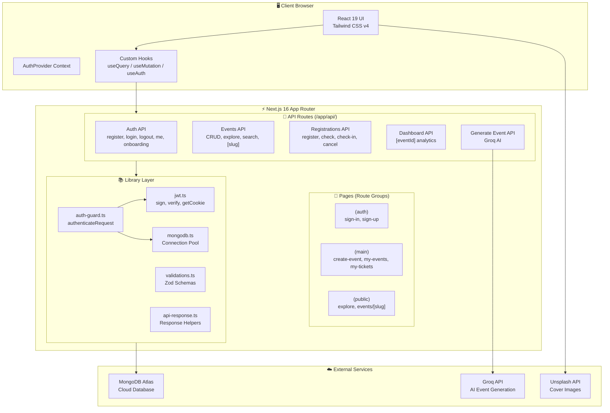
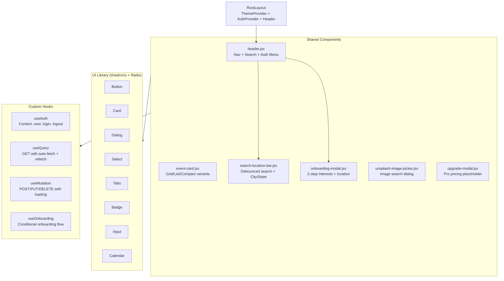
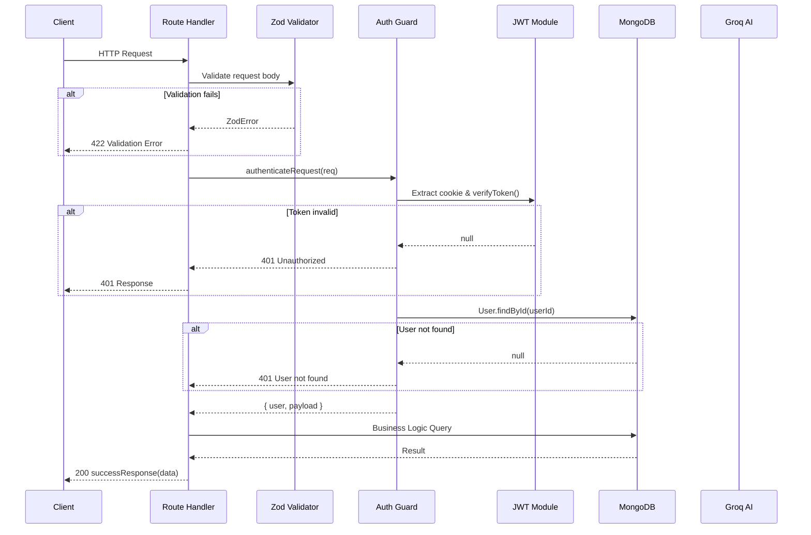
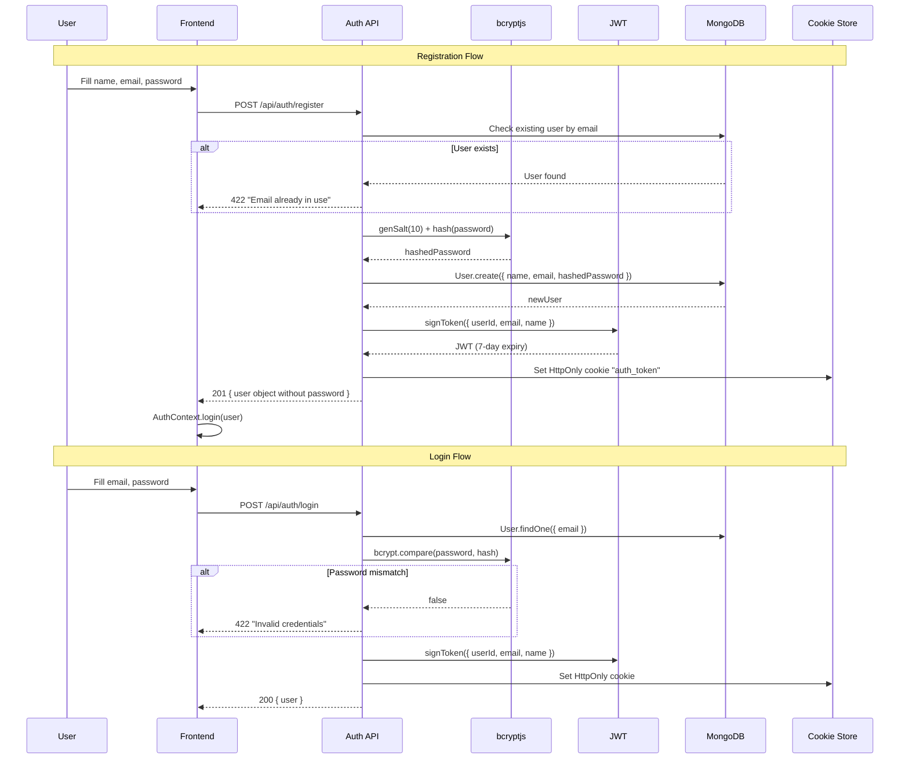
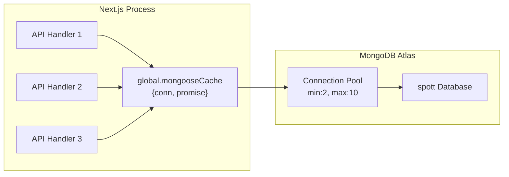
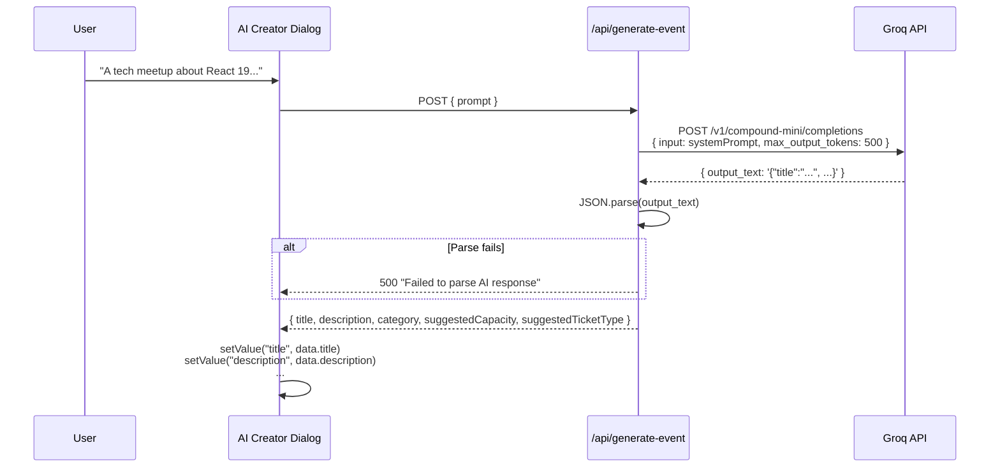
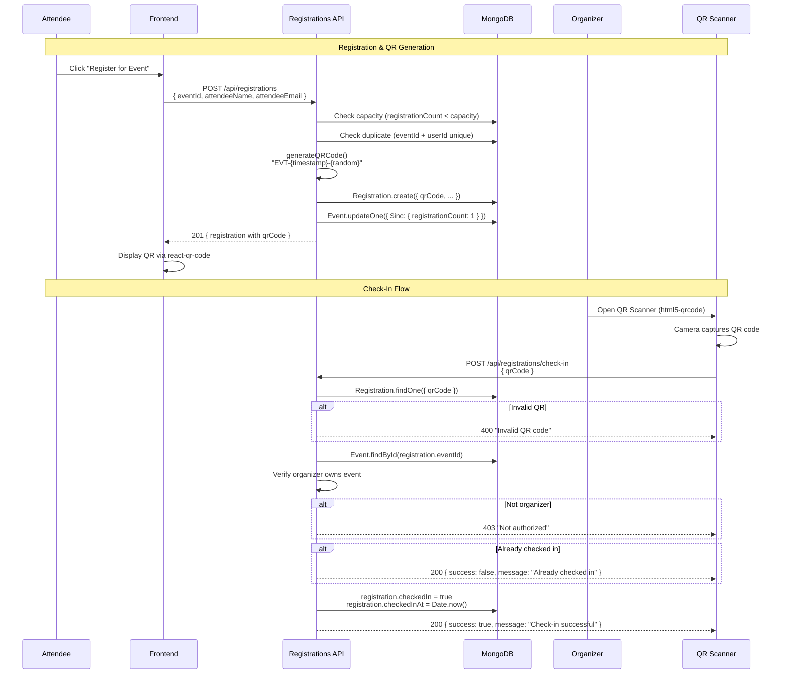

# Spott – Architecture Documentation

---

## 1. High-Level System Architecture

Spott follows a **monolithic full-stack architecture** where the frontend (React), backend (API routes), and database layer all exist within a single Next.js 16 application. This design choice simplifies deployment (single Vercel project), eliminates CORS issues, and enables shared TypeScript types between frontend and backend.



---

## 2. Frontend Architecture

### 2.1 App Router Folder Structure

```
app/
├── layout.js              # Root layout (ThemeProvider, AuthProvider, Header, Footer)
├── page.jsx               # Landing page (/)
├── globals.css            # Global styles (Tailwind CSS v4)
├── favicon.ico
│
├── (auth)/                # Auth route group (no layout nesting prefix)
│   ├── layout.js          # Centered layout wrapper
│   ├── sign-in/page.jsx   # Login form
│   └── sign-up/page.jsx   # Registration form
│
├── (main)/                # Authenticated route group
│   ├── create-event/
│   │   ├── page.jsx       # Event creation form + AI generator
│   │   └── _components/
│   │       └── ai-event-creator.jsx
│   ├── my-events/
│   │   ├── page.jsx       # Organizer's event list
│   │   └── [eventId]/
│   │       ├── page.jsx   # Event dashboard (analytics + attendees)
│   │       └── _components/
│   │           ├── qr-scanner-modal.jsx
│   │           └── attendee-card.jsx
│   └── my-tickets/
│       └── page.jsx       # Attendee's ticket list + QR display
│
├── (public)/              # Public route group
│   ├── explore/
│   │   ├── page.jsx       # Event discovery (featured, local, categories, popular)
│   │   └── [slug]/page.jsx # Dynamic: category or location-based events
│   └── events/
│       └── [slug]/
│           ├── page.jsx   # Event detail page + registration
│           └── _components/
│               └── register-modal.jsx
│
└── api/                   # Backend API routes
    ├── auth/              # Authentication endpoints
    ├── events/            # Event CRUD + discovery
    ├── registrations/     # Ticket management
    ├── dashboard/         # Analytics
    └── generate-event/    # AI generation
```

### 2.2 Route Groups Explained

| Route Group | Purpose | Layout | Auth Required |
|-------------|---------|--------|---------------|
| `(auth)` | Login/Register pages | Centered flex layout | No |
| `(main)` | Organizer/Attendee dashboards | Root layout with Header | Yes (via `useAuth`) |
| `(public)` | Event discovery and details | Root layout with Header | No (optional for registration) |

> **Design Decision:** Route groups `()` in Next.js App Router allow organizing pages without affecting the URL structure. `(auth)/sign-in` maps to `/sign-in`, not `/auth/sign-in`.

### 2.3 Component Architecture



### 2.4 State Management

Spott uses **React Context + Custom Hooks** (no Redux/Zustand):

| State | Management | Scope |
|-------|-----------|-------|
| Authentication | `AuthContext` via `useAuth` | Global |
| Server Data | `useQuery` hook (fetch-based) | Per component |
| Mutations | `useMutation` hook | Per action |
| Form State | `react-hook-form` + Zod | Per form |
| UI State | `useState` | Per component |

---

## 3. Backend Architecture

### 3.1 API Layer

All API routes are Next.js **Route Handlers** under `/app/api/`. Each route exports HTTP method functions (`GET`, `POST`, `DELETE`).

```
app/api/
├── auth/
│   ├── register/route.ts    # POST - User registration
│   ├── login/route.ts       # POST - User login
│   ├── logout/route.ts      # POST - Clear auth cookie
│   ├── me/route.ts          # GET  - Current user
│   └── onboarding/route.ts  # POST - Complete onboarding
├── events/
│   ├── route.ts             # POST - Create event
│   ├── [slug]/route.ts      # GET  - Event by slug, DELETE - Delete event
│   ├── my/route.ts          # GET  - Organizer's events
│   ├── explore/route.ts     # GET  - Featured/Popular/Location/Category events
│   └── search/route.ts      # GET  - Search events by title
├── registrations/
│   ├── route.ts             # POST - Register for event, GET - User's registrations
│   ├── [id]/route.ts        # DELETE - Cancel registration
│   ├── check/route.ts       # GET  - Check if user is registered
│   ├── check-in/route.ts    # POST - QR check-in
│   └── event/[eventId]/route.ts  # GET - Event's registrations (organizer only)
├── dashboard/
│   └── [eventId]/route.ts   # GET  - Event analytics
└── generate-event/
    └── route.js             # POST - AI event generation
```

### 3.2 Request Lifecycle



### 3.3 API Response Pattern

Every API endpoint uses a consistent response format:

```typescript
// Success: { success: true, data: <payload> }
// Error:   { success: false, error: "<message>" }

successResponse(data, status?)     // 200
errorResponse(message, status?)    // 500
unauthorizedResponse(message?)     // 401
forbiddenResponse(message?)        // 403
notFoundResponse(message?)         // 404
validationErrorResponse(message?)  // 422
```

---

## 4. Authentication Architecture



### Cookie Configuration

| Property | Value | Reason |
|----------|-------|--------|
| `httpOnly` | `true` | Prevents JavaScript access (XSS protection) |
| `secure` | `true` (prod) | HTTPS only in production |
| `sameSite` | `strict` | CSRF protection |
| `maxAge` | `604800` (7 days) | Token expiry alignment |
| `path` | `/` | Available across all routes |

---

## 5. Database Layer

### Connection Architecture



The connection uses a **global cache pattern** to prevent multiple connections during Next.js hot reloads:

```typescript
// Cached on global object to survive hot reloads
const cached = global.mongooseCache ?? { conn: null, promise: null };
// Connection pool: maxPoolSize: 10, minPoolSize: 2
// Timeouts: socketTimeout: 45s, serverSelection: 10s
```

---

## 6. AI Layer



The AI generates structured JSON with these fields:
- `title` — Catchy event title (< 80 chars)
- `description` — 2-3 sentence paragraph
- `category` — One of 12 predefined categories
- `suggestedCapacity` — Integer
- `suggestedTicketType` — "free" or "paid"

---

## 7. QR Ticketing Workflow



### QR Code Format
```
EVT-{Unix Timestamp}-{9-char Random Alphanumeric Uppercase}
Example: EVT-1723456789123-A7BX3KM92
```

### Security Measures
1. **Uniqueness** — `qrCode` field has a `unique: true` index
2. **Authorization** — Only the event organizer can perform check-ins
3. **Duplicate Prevention** — `checkedIn` boolean flag prevents re-scanning
4. **Compound Index** — `{eventId, userId}` unique index prevents double registration
