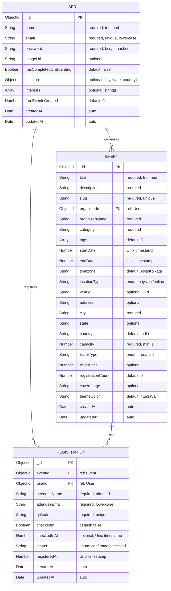

# Spott – Database Design

---

## Entity-Relationship Diagram

---

## Model 1: User (`models/User.ts`)

### Purpose
Stores user accounts with authentication credentials, onboarding preferences (location and interests), and event creation limits.

### Schema Fields

| Field | Type | Required | Default | Validation | Purpose |
|-------|------|----------|---------|------------|---------|
| `_id` | `ObjectId` | Auto | — | — | MongoDB primary key |
| `name` | `String` | ✅ | — | `trim: true` | Display name for attendee cards and organizer profiles |
| `email` | `String` | ✅ | — | `unique: true`, `lowercase: true`, `trim: true` | Login credential, prevents duplicate accounts |
| `password` | `String` | ✅ | — | — | bcrypt hashed (10 salt rounds), never returned in API responses |
| `imageUrl` | `String` | ❌ | — | — | Profile avatar URL (future feature) |
| `hasCompletedOnBoarding` | `Boolean` | ❌ | `false` | — | Gates access to explore/events pages until onboarding is done |
| `location` | `Object` | ❌ | `undefined` | `{ city: required, state: optional, country: required }` | Used for location-based event recommendations |
| `interests` | `[String]` | ❌ | `undefined` | — | Array of category IDs (e.g., `["tech", "music", "sports"]`) for personalization |
| `freeEventsCreated` | `Number` | ❌ | `0` | — | Tracks free event creation count for freemium limits |
| `createdAt` | `Date` | Auto | — | `timestamps: true` | Account creation timestamp |
| `updatedAt` | `Date` | Auto | — | `timestamps: true` | Last profile update |

### Indexes

| Index | Type | Fields | Purpose |
|-------|------|--------|---------|
| `email_1` | Single field | `{ email: 1 }` | Fast email lookup during login (+ implicit unique index) |

### Design Decisions

- **`location` as embedded object** — Not a separate collection because it's always read with the user; no need for independent querying
- **`interests` as string array** — Category IDs are static (defined in `lib/data.js`), so no need for ObjectId references
- **`freeEventsCreated` as counter** — Avoids a `count()` query every time the user creates an event; atomically incremented via `$inc`
- **`hasCompletedOnBoarding`** — Boolean flag is simpler than tracking a separate "onboarding steps" collection

---

## Model 2: Event (`models/Event.ts`)

### Purpose
Stores event details including metadata, location, ticketing, and real-time registration count. Acts as the central entity connecting organizers and attendees.

### Schema Fields

| Field | Type | Required | Default | Validation | Purpose |
|-------|------|----------|---------|------------|---------|
| `_id` | `ObjectId` | Auto | — | — | MongoDB primary key |
| `title` | `String` | ✅ | — | `trim: true`, min 5 chars (Zod) | Event display name |
| `description` | `String` | ✅ | — | min 20 chars (Zod) | Full event description |
| `slug` | `String` | ✅ | — | `unique: true` | URL-friendly identifier: `{title-slug}-{timestamp}` |
| `organizerId` | `ObjectId` | ✅ | — | `ref: "User"` | Foreign key to the event creator |
| `organizerName` | `String` | ✅ | — | — | Denormalized for display without joining User collection |
| `category` | `String` | ✅ | — | One of 12 categories | Event classification for browsing |
| `tags` | `[String]` | ❌ | `[]` | — | Additional searchable tags |
| `startDate` | `Number` | ✅ | — | Unix timestamp (ms) | Event start in epoch milliseconds |
| `endDate` | `Number` | ✅ | — | Unix timestamp (ms) | Event end in epoch milliseconds |
| `timezone` | `String` | ❌ | `Asia/Kolkata` | — | IANA timezone identifier |
| `locationType` | `String` | ❌ | `physical` | `enum: ["physical", "online"]` | Physical venue or virtual event |
| `venue` | `String` | ❌ | — | URL (Google Maps link) | Venue link for navigation |
| `address` | `String` | ❌ | — | — | Human-readable address |
| `city` | `String` | ✅ | — | — | City name for location-based queries |
| `state` | `String` | ❌ | — | — | State name for compound location queries |
| `country` | `String` | ❌ | `India` | — | Country (defaults to India) |
| `capacity` | `Number` | ✅ | — | `min: 1` | Maximum attendee count |
| `ticketType` | `String` | ❌ | `free` | `enum: ["free", "paid"]` | Free or paid event |
| `ticketPrice` | `Number` | ❌ | — | — | Price in INR (only for paid events) |
| `registrationCount` | `Number` | ❌ | `0` | — | Denormalized counter, atomically updated via `$inc` |
| `coverImage` | `String` | ❌ | — | — | Unsplash image URL |
| `themeColor` | `String` | ❌ | `#1e3a8a` | — | Hex color for event page background |
| `createdAt` | `Date` | Auto | — | `timestamps: true` | Event creation timestamp |
| `updatedAt` | `Date` | Auto | — | `timestamps: true` | Last event update |

### Indexes

| Index | Type | Fields | Purpose |
|-------|------|--------|---------|
| `organizerId_1` | Single field | `{ organizerId: 1 }` | Fast lookup of organizer's events (`/api/events/my`) |
| `category_1` | Single field | `{ category: 1 }` | Category-based browsing |
| `startDate_1` | Single field | `{ startDate: 1 }` | Upcoming events query (`startDate >= now`) |
| `slug_1` | Single field | `{ slug: 1 }` | Fast event lookup by slug (+ implicit unique) |
| `city_1_state_1` | **Compound** | `{ city: 1, state: 1 }` | Location-based event discovery |
| `title_text` | **Text** | `{ title: "text" }` | Full-text search on event titles |

### Why Compound Index `{city, state}`?

A compound index on `{city: 1, state: 1}` serves **three query patterns efficiently**:

1. **City + State query** — Uses full index: `{ city: "Mumbai", state: "Maharashtra" }`
2. **City-only query** — Uses left prefix: `{ city: "Mumbai" }`
3. **The explore API** uses both `city` and `state` for location filtering with case-insensitive regex

A separate `city_1` and `state_1` would require **two index scans**; the compound index does it in one.

### Why Text Index on `title`?

The text index enables MongoDB's `$text` operator for full-text search. However, the actual search implementation uses **regex** (`{ title: { $regex: query, "i" } }`) for simplicity, which still benefits from the title being indexed.

### Design Decisions

- **`organizerName` denormalization** — Avoids a `populate("organizerId")` call just to show the organizer's name on event cards
- **`registrationCount` denormalization** — Avoids `Registration.countDocuments({ eventId })` on every event card; updated atomically via `$inc`
- **`startDate`/`endDate` as Numbers** — Unix timestamps (milliseconds) enable simple `$gte` comparisons for upcoming events
- **`slug` generation** — `{title-slug}-{Date.now()}` ensures uniqueness even for identically titled events

---

## Model 3: Registration (`models/Registration.ts`)

### Purpose
Represents the ticket — the link between a User and an Event. Stores the unique QR code, check-in status, and attendee information.

### Schema Fields

| Field | Type | Required | Default | Validation | Purpose |
|-------|------|----------|---------|------------|---------|
| `_id` | `ObjectId` | Auto | — | — | MongoDB primary key |
| `eventId` | `ObjectId` | ✅ | — | `ref: "Event"` | Foreign key to the event |
| `userId` | `ObjectId` | ✅ | — | `ref: "User"` | Foreign key to the attendee |
| `attendeeName` | `String` | ✅ | — | `trim: true` | Name as entered during registration |
| `attendeeEmail` | `String` | ✅ | — | `lowercase: true`, `trim: true` | Email as entered during registration |
| `qrCode` | `String` | ✅ | — | `unique: true` | Format: `EVT-{timestamp}-{9-char-random}` |
| `checkedIn` | `Boolean` | ❌ | `false` | — | Whether attendee has been scanned at venue |
| `checkedInAt` | `Number` | ❌ | — | — | Unix timestamp of check-in time |
| `status` | `String` | ❌ | `confirmed` | `enum: ["confirmed", "cancelled"]` | Registration status |
| `registeredAt` | `Number` | ✅ | — | — | Unix timestamp of registration |
| `createdAt` | `Date` | Auto | — | `timestamps: true` | Record creation |
| `updatedAt` | `Date` | Auto | — | `timestamps: true` | Last update |

### Indexes

| Index | Type | Fields | Purpose |
|-------|------|--------|---------|
| `eventId_1` | Single field | `{ eventId: 1 }` | List all registrations for an event |
| `userId_1` | Single field | `{ userId: 1 }` | List user's tickets ("My Tickets") |
| `eventId_1_userId_1` | **Compound Unique** | `{ eventId: 1, userId: 1 }` | **Prevent duplicate registrations** |
| `qrCode_1` | Single field | `{ qrCode: 1 }` | Fast QR code lookup during check-in |

### Why Compound Unique Index `{eventId, userId}`?

This is the **most critical index** in the schema. It ensures:

1. **Database-level uniqueness** — Even if the application-level check (`findOne`) has a race condition, the database will reject duplicate inserts with a `E11000 duplicate key error`
2. **Atomic constraint** — Two concurrent registration requests for the same user+event will result in exactly one successful insert
3. **Efficient lookups** — The check `Registration.findOne({ eventId, userId })` uses this index directly

### Design Decisions

- **`attendeeName`/`attendeeEmail` denormalization** — Stored separately from User because the attendee may register with different details (e.g., corporate email vs personal)
- **`qrCode` as unique string** — Not using ObjectId because the QR code needs to be human-readable and printable
- **`checkedIn` + `checkedInAt`** — Separate fields allow quick boolean filtering and timestamp tracking
- **Soft delete via `status: "cancelled"`** — Registration is never hard-deleted; the record is preserved for analytics

---

## Index Summary

| Collection | Index | Type | Unique | Fields |
|-----------|-------|------|--------|--------|
| `users` | email | Single | ✅ | `{ email: 1 }` |
| `events` | organizerId | Single | ❌ | `{ organizerId: 1 }` |
| `events` | category | Single | ❌ | `{ category: 1 }` |
| `events` | startDate | Single | ❌ | `{ startDate: 1 }` |
| `events` | slug | Single | ✅ | `{ slug: 1 }` |
| `events` | city+state | Compound | ❌ | `{ city: 1, state: 1 }` |
| `events` | title | Text | ❌ | `{ title: "text" }` |
| `registrations` | eventId | Single | ❌ | `{ eventId: 1 }` |
| `registrations` | userId | Single | ❌ | `{ userId: 1 }` |
| `registrations` | eventId+userId | Compound | ✅ | `{ eventId: 1, userId: 1 }` |
| `registrations` | qrCode | Single | ✅ | `{ qrCode: 1 }` |

**Total: 11 indexes across 3 collections**
