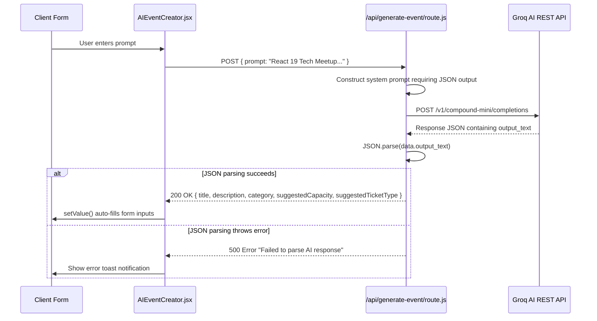
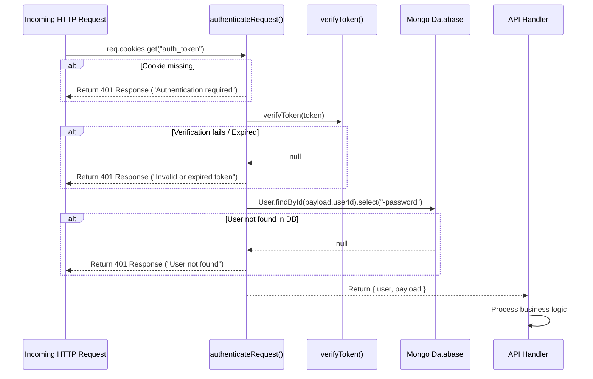
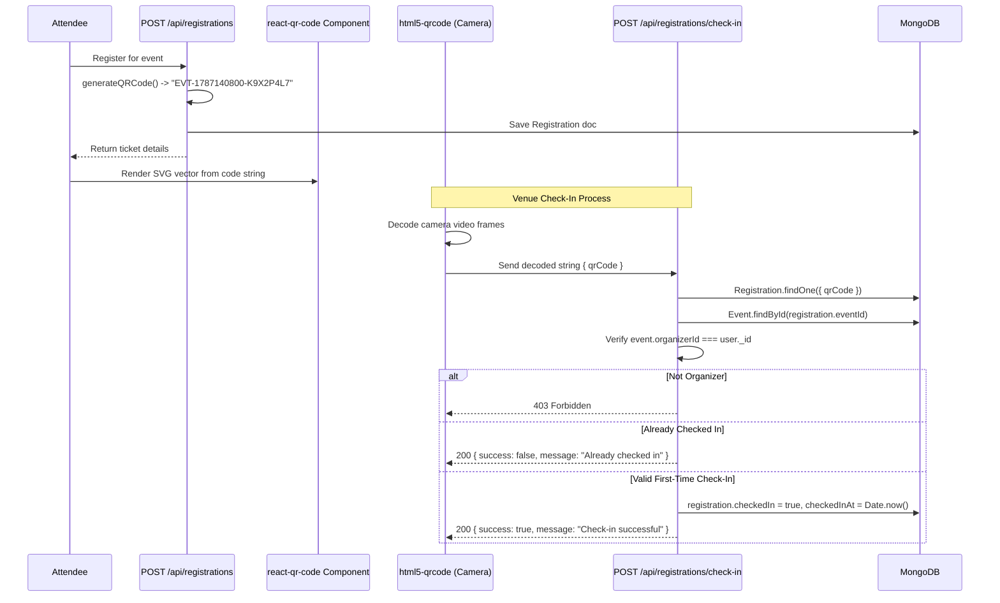

# Spott – Implementation Deep Dive

---

This document provides in-depth technical explanations of how internal systems, algorithms, authentication mechanisms, search pipelines, and QR validation engines operate in **Spott**.

---

## 1. AI Event Generation Engine

The AI event generation system uses the **Groq API** (`https://api.groq.ai/v1/compound-mini/completions`) to transform unstructured natural language input into validated, structured event fields.

### Workflow Sequence



### Technical Code Implementation

```javascript
// app/api/generate-event/route.js
const systemPrompt = `You are an event planning assistant...
Return ONLY valid JSON with properly escaped strings:
{
  "title": "Event title",
  "description": "Detailed event description...",
  "category": "One of: tech, music, sports...",
  "suggestedCapacity": 50,
  "suggestedTicketType": "free"
}
User's event idea: ${prompt}`;

const res = await fetch("https://api.groq.ai/v1/compound-mini/completions", {
  method: "POST",
  headers: {
    "Content-Type": "application/json",
    "Authorization": `Bearer ${process.env.GROQ_API_KEY}`
  },
  body: JSON.stringify({ input: systemPrompt, max_output_tokens: 500 })
});
```

---

## 2. JWT Authentication & Password Security

### Password Hashing (`bcryptjs`)
- During registration (`POST /api/auth/register`), passwords undergo 10 salt rounds:
  ```typescript
  const salt = await bcrypt.genSalt(10);
  const hashedPassword = await bcrypt.hash(password, salt);
  ```
- Passwords are stored exclusively as hashes in MongoDB. During login, `bcrypt.compare(password, user.password)` verifies matches without decrypting.

### Token Signing & Cookie Storage (`lib/jwt.ts`)
- JWT payload contains non-sensitive identification fields: `{ userId, email, name }`.
- Signed using HS256 algorithm with secret `JWT_SECRET` and 7-day expiration (`expiresIn: "7d"`).
- Cookie configuration enforces security properties:
  ```typescript
  cookieStore.set("auth_token", token, {
    httpOnly: true, // Inaccessible to document.cookie (mitigates XSS)
    secure: process.env.NODE_ENV === "production", // Transmitted via HTTPS only
    sameSite: "strict", // Protects against CSRF
    maxAge: 7 * 24 * 60 * 60, // 7 days in seconds
    path: "/",
  });
  ```

---

## 3. Protected Routes & Middleware Guards

Route protection is implemented using a central guard function (`lib/auth-guard.ts`):



### Handler Code Snippet

```typescript
export async function POST(req: NextRequest) {
  const authResult = await authenticateRequest(req);
  if (isAuthResponse(authResult)) {
    return authResult; // Returns 401 Response early
  }
  const currentUser = authResult.user; // Strongly typed IUser object
}
```

---

## 4. Event Search Engine & Mongo Queries

Event search uses a **debounced client-side input component** coupled with **MongoDB regex pattern matching**.

### Search Pipeline Components
1. **Debounced Listener:** `SearchLocationBar.jsx` uses a 300ms debounce buffer:
   ```javascript
   const debouncedSetQuery = useRef(debounce((val) => setSearchQuery(val), 300)).current;
   ```
2. **Conditional Fetching:** `useQuery` skips API calls if `query.trim().length < 2`.
3. **MongoDB Filter:** `/api/events/search/route.ts` filters upcoming events:
   ```typescript
   const searchResults = await Event.find({
     startDate: { $gte: Date.now() },
     title: { $regex: new RegExp(query, "i") }, // Case-insensitive matching
   }).limit(limit).lean();
   ```

---

## 5. QR Code Generation & Scanning Pipeline



### Unique Code Algorithm
```typescript
function generateQRCode() {
  return `EVT-${Date.now()}-${Math.random().toString(36).substring(2, 11).toUpperCase()}`;
}
```

---

## 6. Duplicate Check-in & Registration Prevention

### Duplicate Registration Guard
Duplicate event registration by the same user is blocked at two layers:
1. **Application Layer:**
   ```typescript
   const existing = await Registration.findOne({ eventId: event._id, userId: authResult.user._id });
   if (existing) return errorResponse("You are already registered for this event", 400);
   ```
2. **Database Layer Index:**
   ```typescript
   registrationSchema.index({ eventId: 1, userId: 1 }, { unique: true });
   ```

### Replay & Duplicate Check-in Prevention
When a QR code is scanned:
```typescript
if (registration.checkedIn) {
  return successResponse({
    success: false,
    message: "Already checked in",
    registration,
  });
}
registration.checkedIn = true;
registration.checkedInAt = Date.now();
await registration.save();
```

---

## 7. Real-Time Analytics Calculations

The event dashboard endpoint (`/api/dashboard/[eventId]/route.ts`) computes real-time metrics on demand:

```typescript
const registrations = await Registration.find({ eventId: event._id }).lean();

const totalRegistrations = registrations.filter(r => r.status === "confirmed").length;
const checkedInCount = registrations.filter(r => r.checkedIn && r.status === "confirmed").length;
const pendingCount = totalRegistrations - checkedInCount;

// Revenue calculation (paid events only calculate checked-in revenue)
let totalRevenue = 0;
if (event.ticketType === "paid" && event.ticketPrice) {
  totalRevenue = checkedInCount * event.ticketPrice;
}

// Attendance Rate
const checkInRate = totalRegistrations > 0
  ? Math.round((checkedInCount / totalRegistrations) * 100)
  : 0;

// Countdown Math
const now = Date.now();
const timeUntilEvent = event.startDate - now;
const hoursUntilEvent = Math.max(0, Math.floor(timeUntilEvent / (1000 * 60 * 60)));
```
